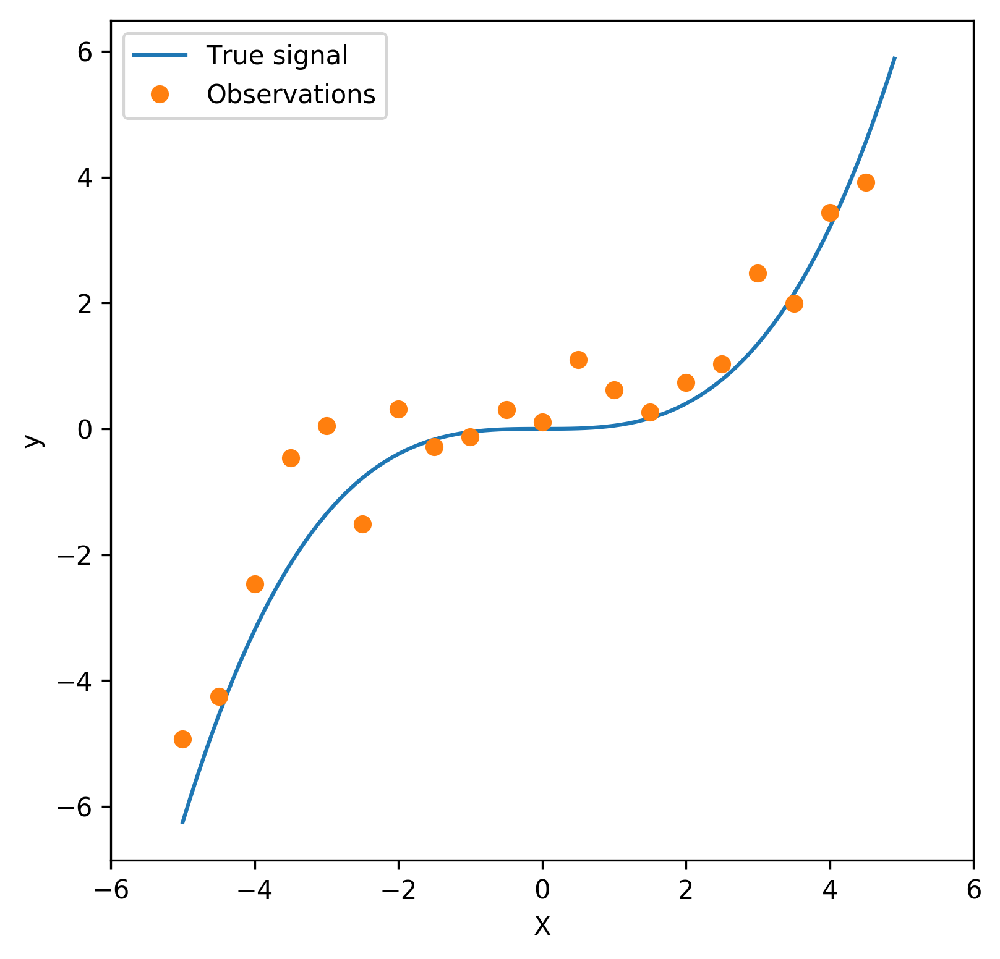
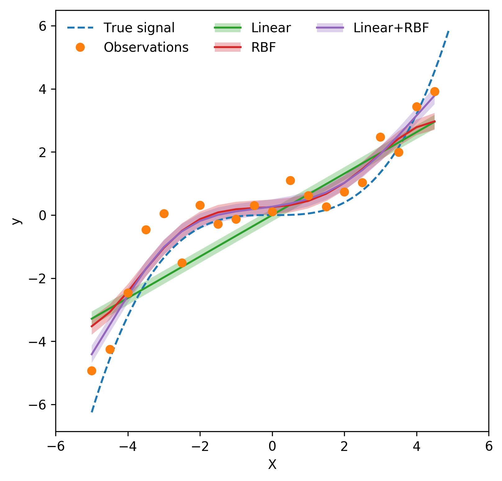
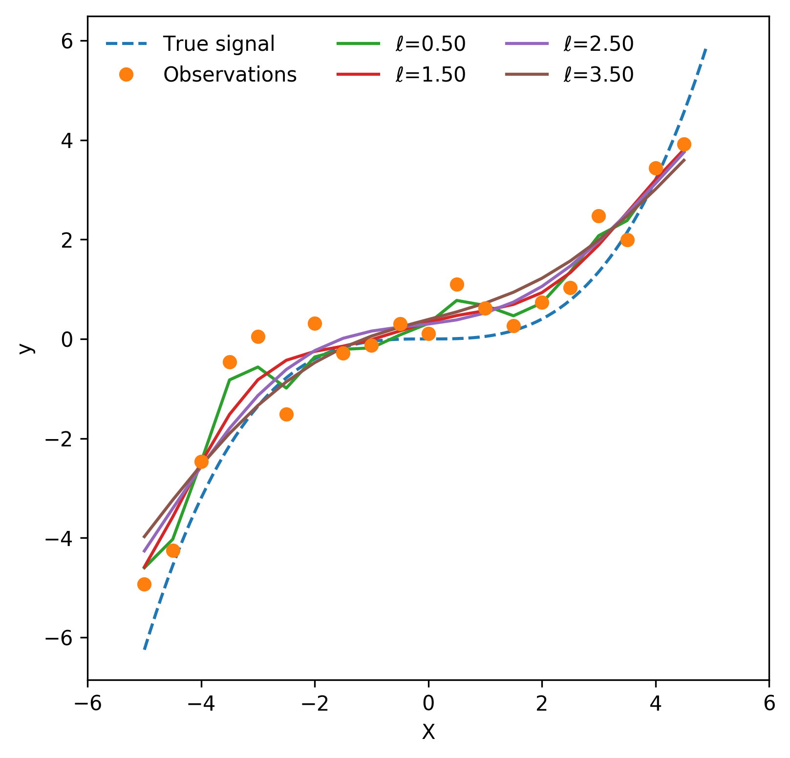
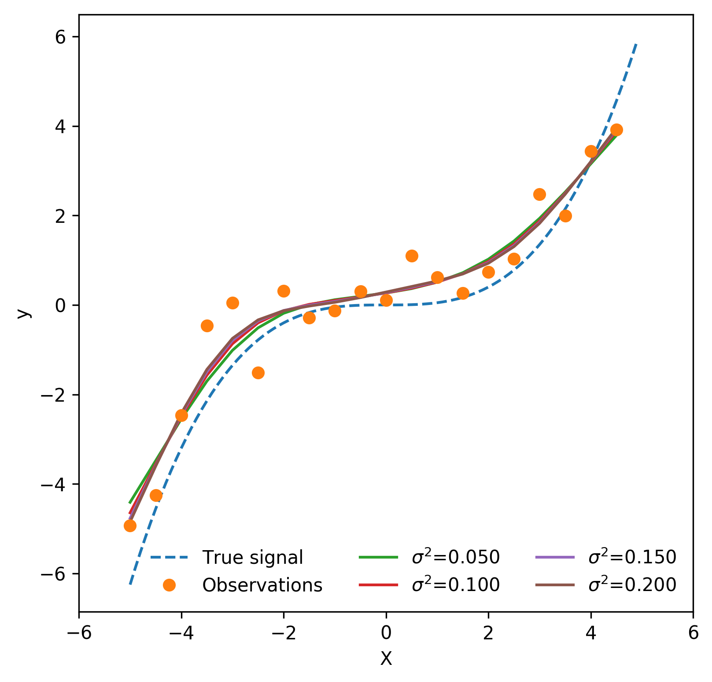
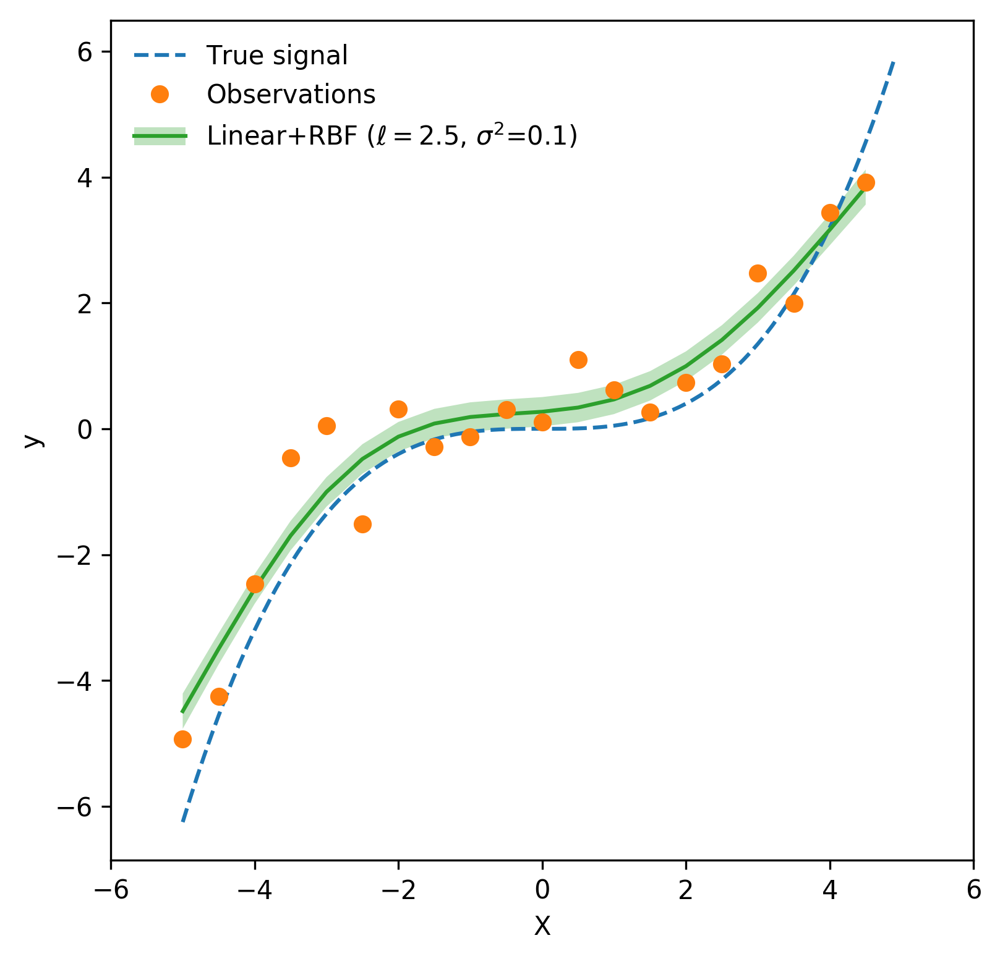

# Introduction

Gaussian process (GP) is a supervised learning method used to solve regression and probabilistic classification problems [@scikit-learn]. It has the term “Gaussian” in its name as each Gaussian process can be seen as an infinite-dimensional generalization of multivariate Gaussian distributions. In this article, we will focus on Gaussian processes for regression purpose – Gaussian process regression (GPR). 

# Methodology

GPR is a non-parametric Bayesian approach for inference. Instead of inferring a distribution over the parameters of a parametric function, Gaussian processes can be used to infer a distribution over the function of interest directly. A Gaussian process defines a prior function, which is converted to a posterior function after having observed some values from the prior [@derivation]. 

A Gaussian process is a random process where any point $\mathbf{x}\in \mathbb{R}^d$ is assigned a random variable $f(\mathbf{x})$ and where the joint distribution of a finite number of these variables $p(f(x_1,..., f(x_N))$ follows a Gaussian distribution:

\begin{equation}
p(\mathbf{f}|\mathbf{X})\sim \mathcal{N}(\mathbf{f}|\boldsymbol \mu,\mathbf{K}) (\#eq:pdf)
\end{equation}

In Equation \@ref(eq:pdf), $\mathbf{f}=(f(x_1),...,f(x_N)), \boldsymbol \mu=(m(x_1),...,m(x_N))$ and $\mathbf{K}_{ij}=k(x_i,x_j)$. $m$ is the *mean* function; people typically use $m(\mathbf{x})=0$ as GPs are flexible enough to model the mean even if it's set to an arbitrary value at the beginning. $k$ is a positive definite function referred to as the *kernel* function or *covariance* function. Therefore, a Gaussian process is a distribution that is defined by $\mathbf{K}$, the covariance matrix. If points $x_i$ and $x_j$ are considered to be similar in the kernel space, the function values at these points, i.e., $f(x_i)$ and $f(x_j)$, will be of similar value likewise.

Suppose we are given the values of the noise-free function $\mathbf{f}$ at some inputs $\mathbf{X}$, a GP prior can be converted into a GP posterior $p(\mathbf{f}^{*}|\mathbf{X}^{*}, \mathbf{X}, \mathbf{f})$, which can be used to make predictions $\mathbf{f}^{*}$ at new inputs $\mathbf{X}^{*}$. By definition of a GP, the joint distribution of observed values $f$ and predictions $\mathbf{f}^{*}$ is Gaussian and can be partitioned into the following: 

\begin{equation}
\begin{pmatrix} \mathbf{f} \\ \mathbf{f}^{*} \end{pmatrix} \sim \mathcal{N}\left(\mathbf{0}, \begin{pmatrix} \mathbf{K} & \mathbf{K}^{*} \\ \mathbf{K^*}^{T} & \mathbf{K}^{**} \end{pmatrix}\right) (\#eq:eq2)
\end{equation}

in which $\mathbf{K^*} = k(\mathbf{X}, \mathbf{X}^*)$ and $\mathbf{K}^{**} = k(\mathbf{X}^*, \mathbf{X}^*)$. With $m$ training data points and $n$ new observations (i.e., test data points), $\mathbf{K}$ is a $m\times m$ matrix, $\mathbf{K}^*$ is a $m\times n$ matrix, and $\mathbf{K}^{**}$ is a $n\times n$ matrix. Based on properties of Gaussian distributions, the predictive distribution (i.e., posterior) is given by

\begin{align} 
p(\mathbf{f^{*}}|\mathbf{X}^{*}, \mathbf{X}, \mathbf{f}) & \sim \mathcal{N}(\mathbf{f}^{*}|\boldsymbol{\mu}^{*}, \boldsymbol\Sigma^{*}) \\ \text{where } \boldsymbol{\mu}^{*} & = \mathbf{K}^{*T}\mathbf{K}^{-1}\mathbf{f} \\ \boldsymbol{\Sigma^{*}} & = \mathbf{K}^{**} - \mathbf{K}^{*T}\mathbf{K}^{-1}\mathbf{K}^{*} (\#eq:eq3)
\end{align} 

Now suppose we have the objective function with noise, $\mathbf{y}=\mathbf{f}+\boldsymbol\sigma$, where noise $\boldsymbol\sigma \sim \mathcal{N}(\mathbf{0}, \sigma_{y}^2\mathbf{I})$ is independently and identically distributed (i.i.d.). The posterior can then be represented as 

\begin{align}
p(\mathbf{f}^{*}|\mathbf{X}^{*}, \mathbf{X},  \mathbf{y}) & \sim \mathcal{N}(\mathbf{y}^{*}|\boldsymbol{\mu}^{*}, \boldsymbol{\Sigma}^{*}) \\ \text{where } \boldsymbol{\mu}^{*} & = \mathbf{K}^{*T}\mathbf{K}^{-1}_{y}\mathbf{y} \\ \boldsymbol{\Sigma}^{*} & = \mathbf{K}^{**} - \mathbf{K}^{*T}\mathbf{K}^{-1}_{y}\mathbf{K}^{*} (\#eq:eq4)
\end{align}

where $\mathbf{K_{y}} = \mathbf{K} + \sigma_y^2\mathbf{I}$.

Finally, to include noise $\boldsymbol{\epsilon}$ into predictions $\mathbf{y}^{*}$, we need to add $\sigma_{y}^2$ to the diagonal of the covariance matrix $\boldsymbol{\Sigma}^{*}$:

\begin{equation}
p(\mathbf{f}^{*}|\mathbf{X}^{*}, \mathbf{X}, \mathbf{y}) \sim \mathcal{N}(\mathbf{y}^{*}|\boldsymbol{\mu}^{*}, \boldsymbol{\Sigma}^{*} + \sigma_y^2 \mathbf{I}) (\#eq:eq5)
\end{equation} 


# Python Implementation and Example

We saw in the previous section that the kernel function $k(\cdot)$ plays a key role in making the predictions in GPR. Instead of building the kernels and GPR architecture from scratch, we can leverage the existing Python packages that have implemented GPR. The frequently used ones are `scikit-learn`/`sklearn` [@scikit-learn], `GPyTorch` [@GPyTorch], and `GPflow` [@GPflow] . The `sklearn` version is implemented mainly upon `NumPy` (simple and easy to use, but has limited hyperparameter tuning options), while `GPyTorch` is built via `PyTorch` (highly flexible, but requires some prior knowledge of `PyTorch` to build the architecture), and `GPflow` is built upon `TensorFlow` (flexible in terms of hyperparamter optimization, straightforward to construct the model). Weighing the pros and cons of different implementation, the GPR models demonstrated in the following sections are implemented using `GPflow`. 

## Toy Dataset Creation

To illustrate how kernels work in GPR, we will look at a simple toy dataset curated "on purpose". Figure \@ref(fig:signal) shows the true distribution $f(\mathbf{x})$ and the observations collected. The goal is to build a model to find the real signal based on the data observed, but the challenge is that real-world observations will always come with noise that perturb the underlying patterns. Thus, selecting the proper kernels and tuning the hyperparameters of the kernels is critical in ensuring the model is neither _overfitted_ nor _underfitted._


```{r signal, fig.align='center', fig.cap="Example dataset. The blue line represents the true signal (i.e., $f$), the orange dots represent the observations (i.e., $f+\\epsilon$).", fig.pos="H"}

```

Example dataset.

## Kernel Selection

There is an infinite number of kernels that we can choose when fitting the GPR model. For simplicity, we will only look at the two most commonly used functions -- the linear kernel and the Radial basis function (RBF) kernel. 

Linear kernel is one of the simplest kernel functions, parameterized by a variance ($\sigma^2$) parameter. The construction of the kernel is as follows, 

\begin{equation} 
k(x_i, x_j) = \sigma^2 + x_i \times x_j (\#eq:linear)
\end{equation} 

Note that the kernel is called a homogeneous linear kernel when $\sigma^2=0$.

The RBF kernel is a stationary kernel. It is also known as the “squared exponential” kernel. It is parameterized by a lengthscale ($\ell$) parameter, which can either be a scalar or a vector with the same number of dimensions as the inputs, and a variance ($\sigma^2$) parameter, which controls the spread of the distribution. The kernel is given by

\begin{equation}
k(x_i, x_j) = \sigma^2 \exp \left( \frac{-(x_j-x_i)^2}{2\ell^2} \right) (\#eq:rbf)
\end{equation}

The RBF kernel is infinitely differentiable, which implies that GPs with this kernel have mean square derivatives of all orders, and are thus smooth in shape.

Using the data observed, let's look at what happens when we fit a GPR model using different kernel functions. Figure \@ref(fig:kernels) illustrates the effect of the kernel. It's clear that the linear kernel predicts a purely linear relation between the input and the target, which gives an underfitted model. The RBF kernel interpolates the data points quite well, but isn't very good at extrapolation (i.e., predicting unseen data points). As we can see, by trying to pass through as many data points as possible, the RBF kernel is fitted to the noise, creating an overfitted model. The combination of linear and RBF kernel, in comparison, has the best balance between interpolation and extrapolation -- it interpolates the data points well enough, at the same time of extrapolating unseen data points at the two ends reasonably. 

```{r kernels, fig.align='center', fig.cap="Kernel selection. The green, red, and purple lines demonstrate the predictions made by GPR when using the Linear, RBF, and summation of the linear and RBF kernels, respectively. Shaded region around each curve represents the 95\\% confidence interval associated with the point estimates.", fig.pos="H"}

```

Notice that each of the three prediction curves have its associated empirical confidence intervals. Because GPR is a probabilistic model, we can not only get the point estimate, but also compute the level of confidence in each prediction. The confidence intervals (i.e., the shaded region around each curve) shown in Figure \@ref(fig:kernels) are the 95% confidence intervals of each kernel, where we see the intervals of non-linear kernels (RBF kernel, and the combination of linear and RBF kernel) touch the true signal, meaning their predictions are close enough to the ground truth with good confidence.

## Hyperparemter Optimization

In addition to determining the kernel to use, hyperparamter tuning is another important step to ensure a well-fitted model. As shown in Equation \@ref(eq:linear) and \@ref(eq:rbf), the RBF kernel depends on two parameters -- the lengthscale ($\ell$), which controls the smoothness of the distribution, and variance ($\sigma^2$), which decides the spread of the curve. 

Figure \@ref(fig:HP) shows the optimization of the two key parameters. From the plot on the left, we see as the lengthscale decreases, the fitted curve becomes less smooth and more overfitted to the noise, while increasing the lengthscale results in a smoother shape. From the plot, the lengthscale chosen is 2.5, a value at which the model has a good balance between overfitting and underfitting. Figure on the right shows the effect of variance parameter by fixing the lengthscale to 2.5. A smaller variance results in a smoother curve, whereas a larger variance gives a more overfitted model. From the plot, we observe changing the value of variance has a relatively smaller impact on the shape of the curve, comparing to results from Figure \@ref(fig:lengthscales). Like before, the variance parameter is chosen in a way such that the balance between overfitting and underfitting is retained. Hence, using a lengthscale of 2.5, the optimized variance is determined to be 0.1. 

```{r HP,  echo=F, out.width = "50%",fig.show='hold', fig.align="center", fig.subcap=c("lengthscales", "variance"), fig.cap=c("Hyperparameter optimization of lengthscales (left) and variance (right) hyperparameter.")}
par(mfrow=c(1,2))
 
 
```

# Discussion and Conclusion

In this article, we looked at the rationale behind the GPR model, as well as a simple example that illustrates the effect of choosing different kernel functions and the associated hyperparameters. Figure \@ref(fig:final) below shows the optimal model found after the kernel selection and hyperparameter optimization step. It's clear that the combination of the linear and RBF kernel captures the true signal quite accurately, and its 95% confidence interval aligns with degree of noise in the data distribution quite well. 

```{r final, fig.align='center', fig.pos="H", fig.cap="Predictions from the optimized GPR model, with the associated 95\\% confidence interval."}

```


To summarize, there are three advantages that GPR has over many other ML models: (1) interpolating – the prediction from GPR interpolates the observations for most types of kernel functions, (2) probabilistic -- since the prediction is probabilistic, we can compute its empirical confidence intervals, and (3) versatile, different types and combinations of kernel functions can be used to fit the model. 

Next time, we will look at how GPR can applied to solve real-world problems and derive insights. Stay tuned! 


# References


